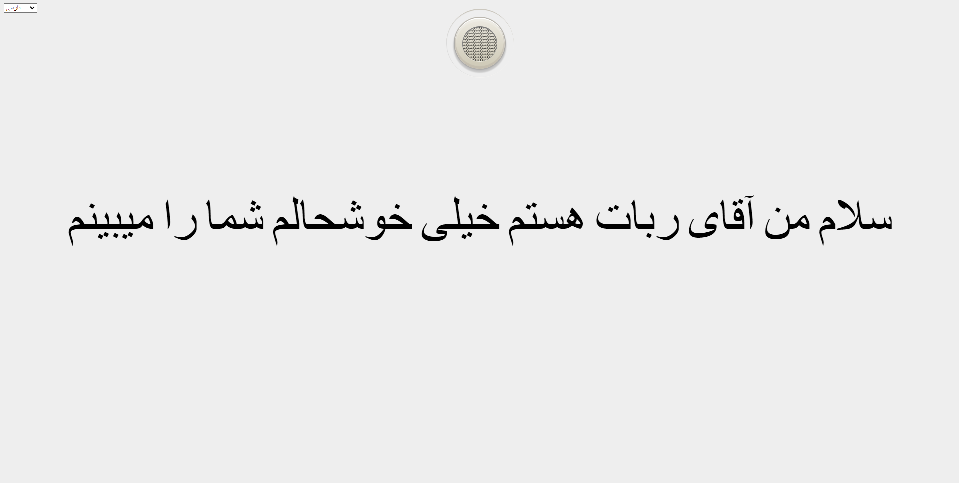

<h1 align="center"> MR-Voice-Recognition 👋</h1>

 
  

> Voice-Recognition-App (FA-IR / EN-US)

  

## Author`

👤 **Milad khajavi**

* Website: [miladkhajavi.ir](https://miladkhajavi.ir)
* App: [homie.miladkhajavi.ir](https://homie.miladkhajavi.ir)
* Github: [@miladkhajavi](https://github.com/miladkhajavi)
* LinkedIn: [@miladkhajavi](https://linkedin.com/in/miladkhajavi)

## Show your support

Give a ⭐️ if this repo helped you!

***

 ❤️ Thank you ❤️
